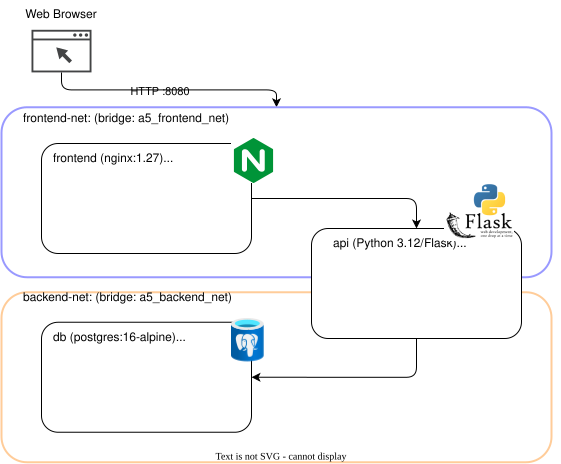

# Progettino A5: Frontend + API + DB (3-tier con Docker)

**Autore:** *Andrea Manitta*<br>
**ID Progetto:** A5<br>
**Repo:** https://github.com/amanitta/dspa-nwsoftvirt-exam

---

## 1. Obiettivo

Il progettino realizza un **expense tracker** (tracker di spese personali) a tre livelli interamente containerizzato con Docker Compose. Un sito statico servito da nginx funge da frontend; le operazioni sui dati transitano attraverso una REST API Python/Flask; la persistenza è affidata a un database PostgreSQL. I tre container sono collegati tramite **due reti Docker separate**: `frontend-net` mette in comunicazione solo nginx e l'API, mentre `backend-net` mette in comunicazione solo l'API e il DB. Il frontend non può mai raggiungere direttamente il database. L'API espone anche un endpoint `/expenses/summary` che delega a PostgreSQL un'aggregazione `GROUP BY category`, restituendo per ogni categoria il totale, la media, il minimo e il massimo delle spese.

---

## 2. Architettura



**Componenti:**

| Container | Immagine base | Ruolo | Reti |
|-----------|---------------|-------|------|
| `a5_frontend` | `nginx:1.27-alpine` | Serve `index.html`; fa reverse-proxy di `/api/*` verso l'API | `frontend-net` |
| `a5_api` | build locale (Python 3.12) | REST API Flask: CRUD spese + `/expenses/summary` (GROUP BY in PostgreSQL) | `frontend-net` + `db-net` |
| `a5_db` | `postgres:16-alpine` | Persistenza dati; porta 5432 raggiungibile solo via `db-net` | `db-net` |

**Flusso di una richiesta (esempio: riepilogo per categoria):**
1. Il browser chiama `GET /api/expenses/summary` su `localhost:8080`.
2. nginx (sull'interfaccia `frontend-net`) fa proxy verso `http://api:5000/expenses/summary`.
3. Flask esegue su PostgreSQL via `db:5432` una query `SELECT … GROUP BY category`.
4. La risposta JSON con i totali per categoria risale la catena fino al browser.

---

## 3. Prerequisiti

| Software | Versione testata | Note |
|---|---|---|
| Linux (Ubuntu 24.04 / Debian 12) | — | Testato su Ubuntu 24.04 LTS |
| Docker Engine | ≥ 26.x | `docker --version` |
| Docker Compose plugin | ≥ 2.27 | `docker compose version` |
| curl | qualsiasi | solo per i test da terminale |

---

## 4. Come riprodurre passo-passo

```bash
# 1. Clona il repository
git clone git@github.com:amanitta/dspa-nwsoftvirt-exam.git
cd dspa-nwsoftvirt-exam
```

```bash
# 2. Rendi eseguibili gli script
chmod +x scripts/setup.sh scripts/teardown.sh
```

```bash
# 3. Avvia lo stack (build + up + health-check)
#    Atteso: output "Stack is up! Open http://localhost:8080"
bash scripts/setup.sh
```

```bash
# 4. Verifica che tutti e tre i container siano "healthy" / "running"
#    Atteso: a5_frontend (Up), a5_api (healthy), a5_db (healthy)
docker compose ps
```
```bash
# 5. Apri il browser
#    Atteso: pagina "Notes Board" con campo di input
xdg-open http://localhost:8080   # oppure aprire manualmente il browser
```

---

## 5. Verifica del funzionamento

### 5.1 Interfaccia web

Aprire `http://localhost:8080`:  
- Inserire importo, categoria, descrizione e data, poi premere **Aggiungi** (o Invio).  
- La spesa deve comparire nella tabella in fondo e aggiornare immediatamente il riquadro di riepilogo per categoria (totale, media, min, max).  
- Il pulsante **✕** deve eliminare la riga e ricalcolare il riepilogo.

### 5.2 API da terminale

```bash
# Health-check dell'API (via nginx)
# Atteso: {"db": "reachable", "status": "ok"}
curl -s http://localhost:8080/api/health | python3 -m json.tool
```

```bash
# Aggiunta di due spese
# Atteso: JSON con id, amount, category, description, expense_date  (HTTP 201)
curl -s -X POST http://localhost:8080/api/expenses \
     -H "Content-Type: application/json" \
     -d '{"amount": 45.50, "category": "Alimentari", "description": "Spesa supermercato", "date": "2026-05-04"}' \
     | python3 -m json.tool;

curl -s -X POST http://localhost:8080/api/expenses \
     -H "Content-Type: application/json" \
     -d '{"amount": 12.00, "category": "Trasporti", "description": "Biglietto treno", "date": "2026-05-04"}' \
     | python3 -m json.tool
```

```bash
# Lista completa spese (ordinate per data DESC)
# Atteso: array JSON con le due spese appena create
curl -s http://localhost:8080/api/expenses | python3 -m json.tool
```

```bash
# Riepilogo per categoria (GROUP BY eseguito in PostgreSQL)
# Atteso: {"by_category": [{"category": "Alimentari", "count": 1, "total": ..., "avg": ..., ...}, ...], "grand_total": {...}}
curl -s http://localhost:8080/api/expenses/summary | python3 -m json.tool
```

### 5.3 Isolamento di rete

La specifica richiede esplicitamente tre controlli. I comandi usano `nslookup` (presente in tutte le immagini alpine) e `python3 -c socket` (disponibile nell'immagine Python dell'API).

```bash
# Verifica 1 — frontend NON vede il DB (DNS fallisce: NXDOMAIN)
# Atteso: "server can't find db... NXDOMAIN"
docker exec a5_frontend nslookup db
```

```bash
# Verifica 2 — api vede il DB (DNS risolve + TCP aperto)
# Atteso: IP del container db  (es. 172.22.0.2)
docker exec a5_api python3 -c \
  "import socket; print(socket.getaddrinfo('db',5432)[0][4])"
```

```bash
# Verifica 3 — api vede frontend; db NON vede frontend
# Atteso api:  IP del container frontend
docker exec a5_api python3 -c \
  "import socket; print(socket.getaddrinfo('frontend',80)[0][4])"
# Atteso db:   "server can't find frontend... NXDOMAIN"
docker exec a5_db nslookup frontend
```

```bash
# Ispezione strutturale delle due reti
# Atteso frontend-net: a5_frontend + a5_api  (a5_db assente)
docker network inspect a5_frontend_net \
  --format '{{range $k,$v := .Containers}}{{$v.Name}} {{end}}'
```

```bash
# Atteso db-net: a5_api + a5_db  (a5_frontend assente)
docker network inspect a5_db_net \
  --format '{{range $k,$v := .Containers}}{{$v.Name}} {{end}}'
```

```bash
# Panoramica reti del progetto
docker network ls --filter name=a5_
```

### 5.4 Persistenza dei dati

```bash
# Riavvia solo il container API (simulazione crash/deploy)
docker compose restart api
```

```bash
# Le spese devono essere ancora presenti (sono nel volume db, non nel container api)
curl -s http://localhost:8080/api/expenses | python3 -m json.tool
```

### 5.5 Teardown

```bash
# Ferma e rimuove container, reti e volume
bash scripts/teardown.sh
# Atteso: nessun container/rete/volume con prefisso "a5_" rimasto
```

---

## 6. Riflessioni e punti aperti

**Cosa ho scoperto:**

- La separazione in due reti non richiede nessuna regola `iptables` esplicita: Docker gestisce automaticamente le regole di forwarding tra bridge. Il container `frontend` non ha nemmeno una route verso `db-net`, quindi qualunque tentativo di contattare il DB fallisce a livello DNS prima ancora che a livello TCP.

- Il container `api` funge da unico *gateway* tra i due tier. Questo è esattamente il pattern di sicurezza atteso: se un attaccante compromettesse il frontend non avrebbe accesso diretto al DB perché i due tier vivono su reti logicamente separate.

- L'endpoint `/expenses/summary` delega l'aggregazione (`GROUP BY category`, `SUM`, `AVG`, `MIN`, `MAX`) direttamente a PostgreSQL anziché recuperare tutte le righe e calcolare in Python. Il database è ottimizzato per questo tipo di operazioni e la quantità di dati trasferiti sulla rete interna (`db-net`) si riduce drasticamente al crescere delle spese.

- `healthcheck` in Compose è essenziale: senza `depends_on: condition: service_healthy`, Flask tenterebbe di connettersi a PostgreSQL prima che il cluster sia pronto. Il `init_db()` con retry è una seconda linea di difesa. In `python:3.12-slim` non è presente `wget` né `curl`, quindi il probe usa `urllib` della stdlib Python.

**Domande aperte / miglioramenti futuri:**

1. **Autenticazione API:** le route sono attualmente aperte. In produzione si dovrebbe richiedere un token o sessioni per isolare i dati per utente.
2. **Filtri temporali:** l'endpoint `/expenses/summary` potrebbe accettare parametri `?from=&to=` per aggregare solo un periodo; la query SQL cambierebbe aggiungendo `WHERE expense_date BETWEEN $1 AND $2`.
3. **Volume e backup:** il volume `a5_db_data` sopravvive al `docker compose down` ma viene rimosso da `docker compose down -v`. In un contesto reale si potrebbe usare un backup periodico.
4. **Implementazione con FastAPI/Pydantic:** si potrebbe sostituire Flask e fare leva su serializzazione e check automatici di pydantic.

---

## 7. Riferimenti

- [Docker Compose networking](https://docs.docker.com/compose/networking/)
- [Docker Bridge networks](https://docs.docker.com/network/drivers/bridge/)
- [Flask documentation](https://flask.palletsprojects.com/)
- [PostgreSQL Docker Hub](https://hub.docker.com/_/postgres)
- [nginx reverse proxy](https://nginx.org/en/docs/http/ngx_http_proxy_module.html)
- Slide hands-on del corso: `itp-2526-HandsOn.pptx` (prof. Salsano)
- `Docker_WSL2_Guida_Esercitazioni.md` — materiale del corso
